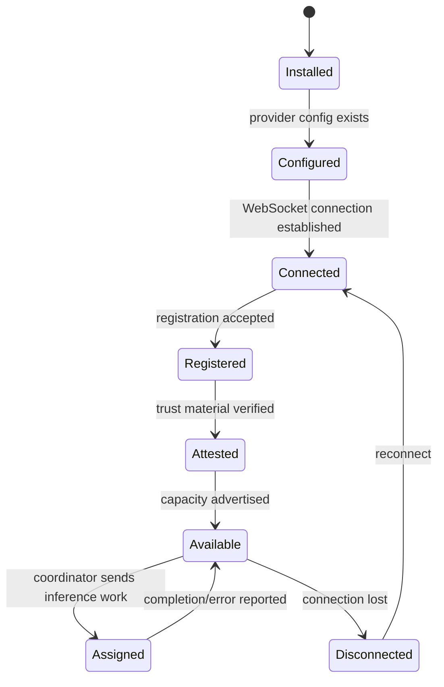

# Provider Lifecycle

Provider lifecycle covers the path from local runtime startup to eligibility for inference assignment.

## Lifecycle

## Requirements

- <!-- req: runtime.provider; source: artifacts/d-inference/service_analyses/darkbloom.md#L210-L274 --> A provider runtime MUST initialize local hardware, security, model, and backend state before advertising useful capacity.
- <!-- req: protocol.provider-registration; source: artifacts/d-inference/architecture_docs/architecture.md#L278-L312 --> A provider MUST register with the coordinator before it can be considered available for inference assignment.
- <!-- req: security.trust-model; source: artifacts/d-inference/architecture_docs/architecture.md#L340-L376 --> The coordinator SHOULD use attestation and security posture to determine provider trust level before routing sensitive work.
- <!-- req: system.role.enclave; source: artifacts/d-inference/service_discovery/components.json#L330-L339 --> Secure Enclave signing material SHOULD be used for provider identity and attestation operations where available.

## Failure handling

- A disconnected provider is not eligible for new work until it reconnects and restores required state.
- A provider that fails attestation should remain in a lower trust state or be excluded from sensitive workloads.
- Runtime failures during assigned work should be reported through the provider lifecycle error path.
