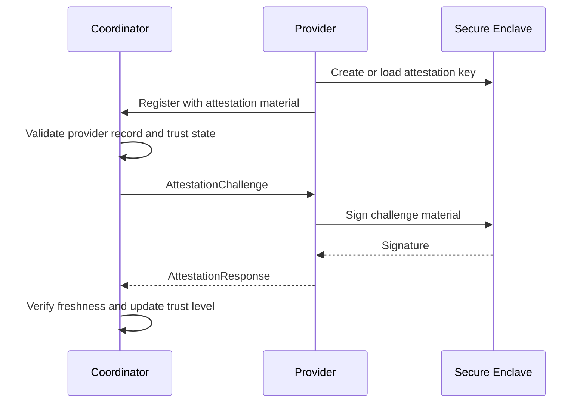

# Security and Trust

DarkBloom's security model combines transport security, encrypted inference payloads, provider runtime hardening, and
Apple Secure Enclave based attestation.

## Trust model

- <!-- req: security.trust-model; source: artifacts/d-inference/architecture_docs/architecture.md#L340-L376 --> Provider trust MUST be evaluated as a graduated state rather than a binary property when attestation and software security posture are available.
- <!-- req: system.role.enclave; source: artifacts/d-inference/service_discovery/components.json#L330-L339 --> Secure Enclave components MUST protect provider signing keys used for hardware-backed attestation and identity operations.
- <!-- req: security.crypto; source: artifacts/d-inference/service_analyses/darkbloom.md#L48-L52 --> The provider cryptographic layer MUST protect inference request/response payloads when encrypted operation is used.
- <!-- req: runtime.provider; source: artifacts/d-inference/service_analyses/darkbloom.md#L210-L274 --> Provider runtimes SHOULD apply local hardening controls before serving assigned inference work.

## Attestation flow

## Threat boundaries

- The coordinator is trusted for routing and accounting, but encrypted inference mode limits plaintext exposure.
- Providers are independently operated and must be attested/hardened before receiving sensitive work.
- Web clients must not be treated as hardware-attestation authorities.
- Analytics consumers should not receive secrets or plaintext inference payloads.

## Open security questions

- What exact fields are signed in provider attestation blobs?
- What freshness window is required for challenge-response validation?
- Which trust levels are eligible for which classes of inference workload?
